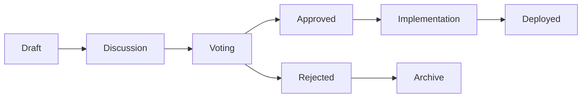

# ZIPS - Zoo Improvement Proposals Service

Core protocol governance and improvement proposal system for Zoo ecosystem.

## Overview

ZIPS (Zoo Improvement Proposals) is the governance framework for proposing, discussing, and implementing changes to the Zoo protocol.

## Proposal Categories

### Technical (ZIP-T)
- Smart contract upgrades
- Protocol optimizations
- Security enhancements
- Integration standards

### Economic (ZIP-E)
- Tokenomics adjustments
- Fee structure changes
- Reward distribution models
- Treasury management

### Governance (ZIP-G)
- Voting mechanism updates
- Proposal thresholds
- Quorum requirements
- DAO structure changes

### Community (ZIP-C)
- Community initiatives
- Partnership proposals
- Marketing campaigns
- Event organization

## Proposal Lifecycle



## API Endpoints

### REST API
```typescript
GET /api/v1/proposals          // List all proposals
GET /api/v1/proposals/:id      // Get specific proposal
POST /api/v1/proposals         // Create new proposal (requires auth)
PUT /api/v1/proposals/:id      // Update proposal (author only)
POST /api/v1/proposals/:id/vote // Cast vote (token holders)
```

### GraphQL API
```graphql
query GetProposals {
  proposals(
    status: ACTIVE
    category: TECHNICAL
    orderBy: VOTES_DESC
  ) {
    id
    title
    author
    votesFor
    votesAgainst
    quorumReached
    deadline
  }
}
```

## Smart Contract Interface

```solidity
interface IZIPGovernance {
    function propose(
        string memory title,
        string memory description,
        bytes memory calldata
    ) external returns (uint256 proposalId);

    function vote(uint256 proposalId, bool support) external;

    function execute(uint256 proposalId) external;
}
```

## Voting Power

Voting power is calculated based on:
- ZOO token holdings (1 token = 1 vote)
- NFT ownership (Genesis = 100 votes, Habitat = 50 votes)
- Staking duration multiplier (up to 2x)
- Participation bonus (active voters get 1.1x)

## Requirements

### Proposal Creation
- Minimum 10,000 ZOO tokens OR
- Genesis NFT holder OR
- Previous successful proposal

### Passing Criteria
- Minimum 4% quorum of total voting power
- Simple majority (>50%) for ZIP-C
- Super majority (>66%) for ZIP-T, ZIP-E
- Ultra majority (>75%) for ZIP-G

## Database Schema

```sql
CREATE TABLE proposals (
    id SERIAL PRIMARY KEY,
    zip_number VARCHAR(20) UNIQUE,
    title VARCHAR(255) NOT NULL,
    description TEXT NOT NULL,
    category VARCHAR(20) NOT NULL,
    author_address VARCHAR(42) NOT NULL,
    status VARCHAR(20) DEFAULT 'draft',
    votes_for BIGINT DEFAULT 0,
    votes_against BIGINT DEFAULT 0,
    execution_payload JSONB,
    created_at TIMESTAMP DEFAULT NOW(),
    voting_starts_at TIMESTAMP,
    voting_ends_at TIMESTAMP,
    executed_at TIMESTAMP,
    tx_hash VARCHAR(66)
);

CREATE TABLE votes (
    id SERIAL PRIMARY KEY,
    proposal_id INTEGER REFERENCES proposals(id),
    voter_address VARCHAR(42) NOT NULL,
    voting_power BIGINT NOT NULL,
    support BOOLEAN NOT NULL,
    reason TEXT,
    voted_at TIMESTAMP DEFAULT NOW(),
    UNIQUE(proposal_id, voter_address)
);
```

## Integration

```javascript
import { ZIPSClient } from '@zoo-labs/zips-sdk';

const client = new ZIPSClient({
    apiUrl: 'https://zips.zoo.game',
    chainId: 1337, // Zoo Chain
    walletProvider: window.ethereum
});

// Create proposal
const proposal = await client.createProposal({
    title: 'Reduce breeding cooldown',
    description: 'Reduce from 7 days to 5 days',
    category: 'ECONOMIC',
    executionCalldata: '0x...'
});

// Vote on proposal
await client.vote(proposal.id, true, 'Great idea!');
```

## License

Proprietary - Zoo Labs, Inc.